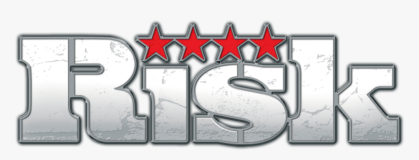

# Risk-AA228

 

## Project Contributors
Jane Boettcher - Undergraduate: Stanford Linguistics '22, Graduate: Stanford Computer Science \
Nico Carballal - Undergraduate: UC Berkeley Mechanical Engineering '21, Graduate: Stanford Mechanical Engineering \
Nyle Wong - Undergraduate: Stanford Math & Physics '24

## Project Overview
We are planning on tackling the game of RISK – the popular game whose name conveniently alludes to the topic of uncertainty. At a high level, we aim to solve the problem of the ideal strategy to conquer the world in the game of RISK. We aim to investigate novel strategies to deal with the copious amount of possible state spaces in the game.

## Root Repositories
### Images
Please insert any images you plan to put into documents here
### Project Documents
Please put any project documents into this folder. For example, the project proposal, the final project paper, or other offficial documents for submission or outside reference.
